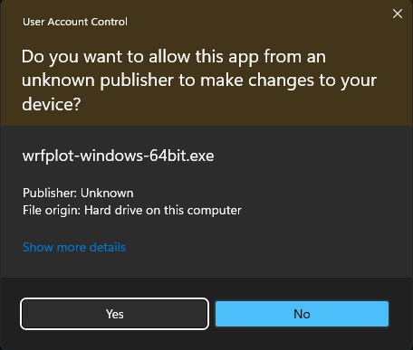
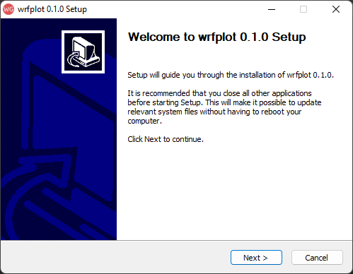
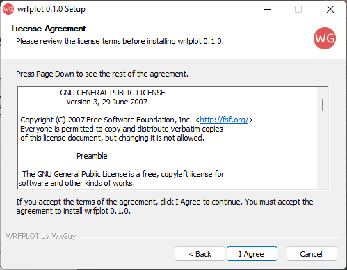
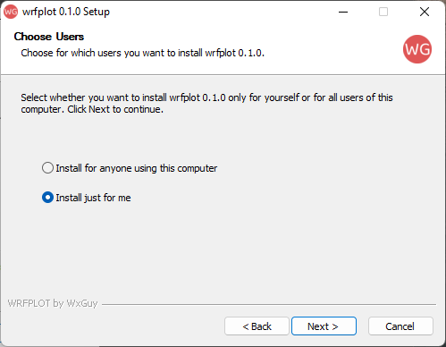
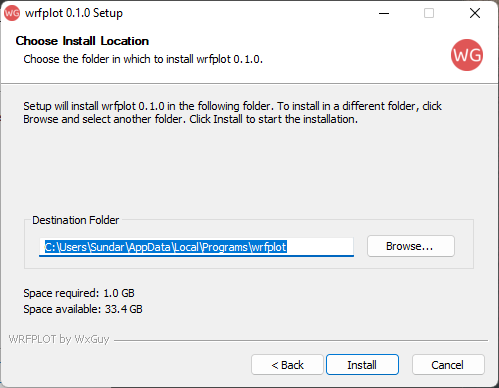
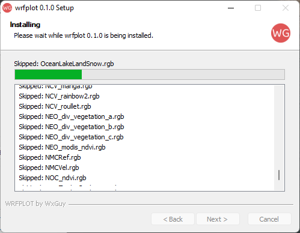
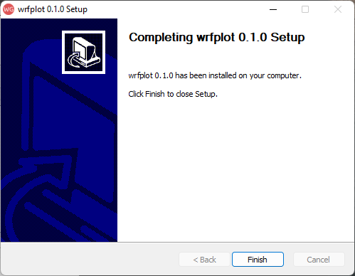

# Installation Guide

This section briefly guides you to install **_wrfplot_** on a variety of Operating Systems viz., Linux, Windows and macOS.

## System Requirements
Here are the following dependencies you should know about before installing wrfplot:

* Operating System (Windows): Windows 10 or above. May work on Windows 7/ 8 but not tested.

* Operating System (Linux): Ubuntu 18.04 or above. If you wish to use it on Red Hat or Cent OS based, then it should be versioned 7 or above.

* Architecture: x86_64 or simple called 64bit. **_Don't download if you have 32bit machine_**. It won't work.

Since it is intended to be used as a command line, the application is distributed as stand-alone on both Linux and Windows. You must download the correct version of application installer or setup file. Both are described in the subsection below.

## Installation under Windows
Go to [https://github.com/wxguy/wrfplot/releases](https://github.com/wxguy/wrfplot/releases) and look for the latest release. The Windows setup executable will have name `wrfplot-windows-64bit.exe` and download it to the local disk. The rest of the installation procedure is same as you do for any other windows setup files. Here are the complete process of installing in visual format:

<figure markdown="span">    
  
  <figcaption>Double Click on Windows Executable</figcaption>
</figure>

<figure markdown="span">    
  
  <figcaption>Accept Windows User Elevation</figcaption>
</figure>

<figure markdown="span">    
  
      <figcaption>Windows Setup Welcome Screen</figcaption>
</figure>

<figure markdown="span">    
  
      <figcaption>Accept User Agreement</figcaption>
</figure>

<figure markdown="span">    
  
      <figcaption>Choose Install Option (recommended `Install just for me`)</figcaption>
</figure>

<figure markdown="span">    
  
      <figcaption>Windows Install Directory (recommended not to change)</figcaption>
</figure>

<figure markdown="span">    
  
      <figcaption>Wait till Install Complete</figcaption>
</figure>

<figure markdown="span">    
  
      <figcaption>Windows Finish Screen</figcaption>
</figure>

That’s it. You have successfully installed `wrfplot`.

## Installation under Linux

Go to [https://github.com/wxguy/wrfplot/releases](https://github.com/wxguy/wrfplot/releases) and look for the latest release. The Linux installer will have name wrfplot-linux-64bit.run. Click on the link and download it to local disk. Thereafter, execute the below command (assuming that the Linux installer is downloaded at ~/Downloads):

```console
$ bash ~/Downloads/wrfplot-linux-64bit.run
```

that would produce the output as indicated below:

```console
Verifying archive integrity...  100%   MD5 checksums are OK. All good.
Uncompressing wrfplot_Linux_Installer  100%
Removing previous install directory...
Installing wrfplot to /home/wxguy/.wrfplot...
Renaming '/home/wxguy/wrfplot' directory to '/home/wxguy/.wrfplot'..
'/home/wxguy/.local/bin' directory already exists. Not creating it.
Linking wrfplot executable...
Updating .bashrc file to include install directory...
/home/wxguy/.local/bin directory already added to PATH. Skipping...
Installation completed. Please restart your terminal to continue using wrfplot...
```

## Installation under macOS

There is no binary distribution made available for macOS at the moment. The support for macOS is provided through miniconda. If you already have miniconda/ anaconda installed, you can execute the following to install `wrfplot`:

```console
$ conda install -c conda-forge wrfplot
```

## Confirm Installation

The easiest way to check the installation is to issue the following command in the terminal:

```console
wrfplot --help
```

This should produce brief information about the `wrfplot` as shown below:

```console
usage: wrfplot [-h] [--list-vars] [--input <input_file>] [--output <output_dir>] [--vars <variable(s)>] [--ulevels <upper-levels>]
                  [--list-cmaps] [--cmap <cmap-name>] [--clevels <contour-levels>] [--dpi <value>] [--gif] [--gif-speed <seconds>]
                  [--version]

Command line application to plot static WRF model prognostic products...

options:
  -h, --help            show this help message and exit
  --list-vars           Show list of variables supported by wrfplot and exit.
  --input <input_file>  Path to WRF generated netCDF.
  --output <output_dir>
                        Path to output directory for saving plotted images.
  --vars <variable(s)>  Name of the variable to be plotted. Multiple variables are to be separated with ','. Use '--list-vars' option
                        to see list of supported variables.
  --ulevels <upper-levels>
                        Provide custom upper level(s) when plotting upper atmospheric data. Each level is to be separated by ',' i.e.,
                        '925,850,700'. Use '--list-vars' to know list of supported upper level variables.
  --list-cmaps          List colour maps (cmaps) supported by wrfplot. Refer https://pratiman-91.github.io/colormaps for information on
                        each colourmaps.
  --cmap <cmap-name>    Valid colormap name to fill colors. Use '--list-cmaps' option to see list of supported colormaps. Must have
                        minimum 11 colors, else will lead to error.
  --clevels <contour-levels>
                        Provide custom contour level(s) to highlight data. Levels are to be in ascending order and separated by ','
                        i.e., '24,26,28'. If single value is provided, clevels will be automatically calculated.
  --dpi <value>         Increase or decrease the plotted image resolution. Default is 125. More is higher resolution and less is course
                        resolution. Higher values will reduce the speed of plot.
  --gif                 If applied, creates an animated GIF image. GIF image will be saved same location as other images with a name
                        specifed in '--vars' option.
  --gif-speed <seconds>
                        Set speed of GIF frame in seconds. Default is 0.5 sec. Lower value increases the speed of animation. To be used
                        with '--gif' option to take effect.
  --version             Print version information of 'wrfplot' and exit.

© J Sundar, wrf.guy@gmail.com, 2024
```

If you get inbuilt help page of wrfplot, then it is ensured that you have successfully installed wrfplot.

