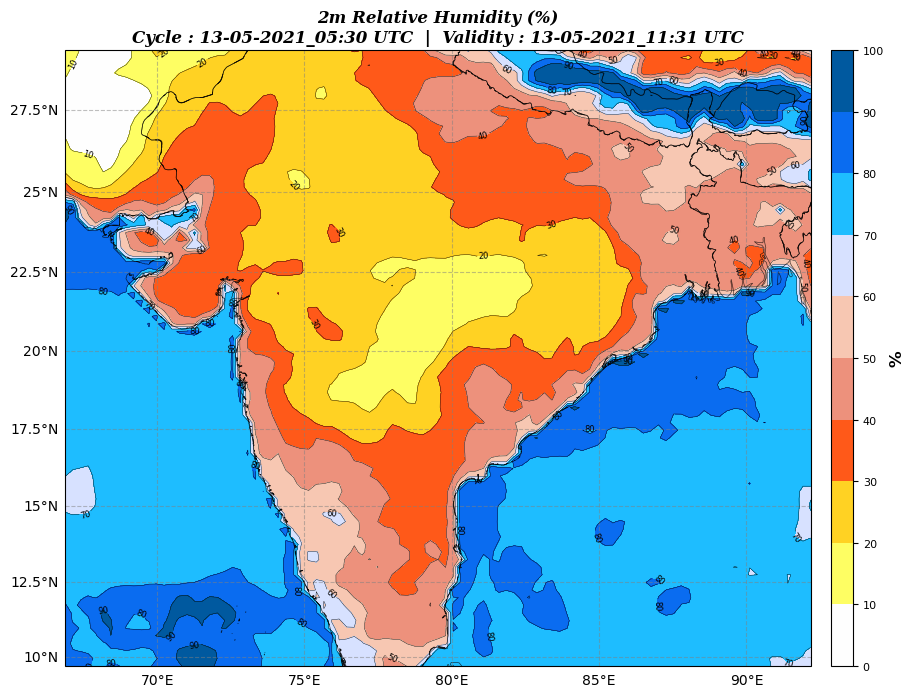
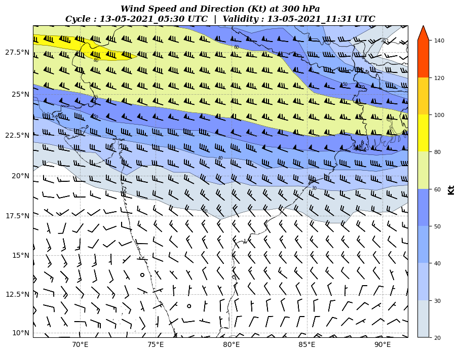
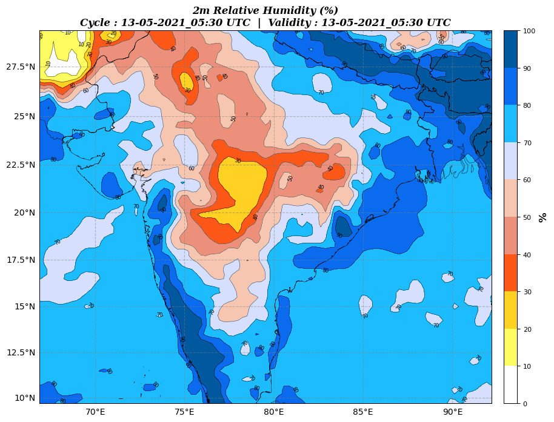

## Basic Usage

The first step in plotting diagnostic variable to find what all variables are supported by wrfplot application. This is required as the application would accept variable names only in certain string format. Therefore, you should list and review the name of variable by issuing the following command in the terminal:

```console
$ wrfplot --list-vars
```

Invoking the above command will produce the following output:

```console
****    ****    ****    ****    ****    ****    ****
Variables starting with 'u_' are upper air variable availabe at 925, 850, 700, 600, 500, 400, 300 and 200 hPa heights...
****    ****    ****    ****    ****    ****    ****

Variable "slp"   --> Mean Sea Level Pressure (hPa)
Variable "winds"   --> Surface (10M) Wind Speed and Direction (Kt)
Variable "rh2"   --> 2m Relative Humidity (%)
Variable "T2"   --> 2m Temperature (°C)
Variable "mcape"   --> CAPE Maximum ($J kg^{1}$)
Variable "mcin"   --> Minimum Convective Inhibition ($J kg^{1}$)
Variable "lcl"   --> Lifting Condensation Level (Meters)
Variable "lfc"   --> Level of Free Convection (Meters)
Variable "ctt"   --> Cloud Top Temperature (°C)
Variable "low_cloudfrac"   --> Low Cloud Coverage (%)
Variable "mid_cloudfrac"   --> Medium Cloud Coverage (%)
Variable "high_cloudfrac"   --> High Cloud Coverage (%)
Variable "mdbz"   --> Maximum Reflectivity (dBZ)
Variable "helicity"   --> Storm Relative Helicity ($m^{2} s^{-2}$)
Variable "pw"   --> Precipitable Water ($kg m^{-2}$)
Variable "td2"   --> 2m Dew Point Temperature (°C)
Variable "ppn_accum"   --> Accumulated Precipitation (mm)
Variable "ppn_conv"   --> Convective Precipitation (mm)
Variable "ppn"   --> Precipitation/ Rain (mm)
Variable "updraft_helicity"   --> Updraft Helicity ($m^{2} s^{-2}$)
Variable "u_theta_e"   --> Equivalent Potential Temperature (°C)
Variable "u_avo"   --> Absolute Vorticity ($10^{-5} s^{-1}$)
Variable "u_dbz"   --> Reflectivity (dBz)
Variable "u_geopotential"   --> Geopotential - Mass Grid ($m^{2} s^{-2}$)
Variable "u_omg"   --> Omega ($Pa s^{-1}s$)
Variable "u_pressure"   --> Full Model Pressure (hPa)
Variable "u_pvo"   --> Potential Vorticity (PVU)
Variable "u_td"   --> Dew Point Temperature (°C)
Variable "u_rh"   --> Relative Humidity (%)
Variable "u_theta"   --> Potential Temperature (°C)
Variable "u_temp"   --> Temperature (°C)
Variable "u_tv"   --> Virtual Temperature (°C)
Variable "u_twb"   --> Wet Bulb Temperature (°C)
Variable "u_winds"   --> Wind Speed and Direction (Kt)
Variable "u_cin"   --> Convective Inhibition ($J kg^{1}$)
Variable "u_cape"   --> Convective Available Potential Energy ($J kg^{1}$)
```

The above console print has two names. One with quote and the other is without. The name within quote such as "slp" is called short variable, and without a quote is called long variable. You can read through a list to take note of what parameter you want to plot. For example, if you need to plot `2m Relative Humidity`, then you need to remember the sort variable name in the first quote “” i.e, `“rh2”`. With this, we will proceed ahead to plot “rh2” variable.
To plot any variable, there are minimum three arguments are to be provided. They are `--vars`, `--input` and `--output`. Details of this would be discussed later.

## Plotting Surface Variable

All the variables which does not start with `u_` string are surface variable. Now, let's go ahead and start plotting the variable “2m Relative Humidity” named as “rh2”:

```console
$ wrfplot --vars "rh2" --input ../../test/wrfout_data/wrfout_d01_2021-05-13_00_00_00 --output ../../test/wrfout_data/output_images
```

Where:

* `--vars` to indicate name of variable to plot
* `--input` is path to wrfout netCDF file
* `--output` is path to directory where final image files are required to be saved. The directory will be created if it does not exist

Executing the above command will produce the following output in the terminal indicating the progress of plots and location of files saved in local filesystem.

```console
*** Initialising plotting for variable : "rh2" ***

        Plotting "rh2" for Time : "13-05-2021_05:30" UTC                                                                                 
          Image saved at : "../../test/wrfout_data/output_images/rh2_13-05-2021_05_30.png"                            
        Plotting "rh2" for Time : "13-05-2021_08:30" UTC                                                                                 
          Image saved at : "../../test/wrfout_data/output_images/rh2_13-05-2021_08_30.png"                            
        Plotting "rh2" for Time : "13-05-2021_11:31" UTC                                                                                 
          Image saved at : "../../test/wrfout_data/output_images/rh2_13-05-2021_11_31.png"                            
        Plotting "rh2" for Time : "13-05-2021_14:30" UTC                                                                                 
          Image saved at : "../../test/wrfout_data/output_images/rh2_13-05-2021_14_30.png"                            
        Plotting "rh2" for Time : "13-05-2021_17:30" UTC                                                                                 
          Image saved at : "../../test/wrfout_data/output_images/rh2_13-05-2021_17_30.png"                            
                                                                                                                                           
Plotting process completed. It took 0H:0M:9.682410S
```

The plotted output for variable will look like below:

<figure markdown="span">
  
      <figcaption>Sample Relative Humidity Plot</figcaption>
</figure>

## Plotting Upper Atmospheric Variables

`wrfplot` supports a few upper atmospheric variables. These variables are indicated with u_ tag for ease of identification. By default, the plot for upper atmospheric variables would be plotted for 925, 850, 700, 600, 500, 400, 300 & 200hPa. The upper levels can be controlled using --ulevels though. If you want to plot upper winds, you can specify the variable with following command:

```console
$ wrfplot --vars "u_winds" --input ../../test/wrfout_data/wrfout_d01_2021-05-13_00_00_00 --output ../../test/wrfout_data/output_images
```

<figure markdown="span">
  
      <figcaption>Sample Upper Winds Plot at 300hPa</figcaption>
</figure>

## Creating Animation to Plots

You can also create an animation of your plots using `--gif` option. Example command is given below:

```console
$ wrfplot --vars "rh2" --gif --input ../../test/wrfout_data/wrfout_d01_2021-05-13_00_00_00 --output ../../test/wrfout_data/output_images 
```

This would produce an animated `gif` image as shown below:

<figure markdown="span">
  
      <figcaption>Sample Animation Plot</figcaption>
</figure>

By default, the speed of the animation is kept as `0.5` sec. If you wish to increase or decrease the speed, you can do so by with `--gif-speed` option as indicated below where speed is increased to `0.25` sec:

```console
$ wrfplot --vars "rh2" --gif --gif-speed 0.25 --input ../../test/wrfout_data/wrfout_d01_2021-05-13_00_00_00 --output ../../test/wrfout_data/output_images 
```

This would increase the speed of animation as shown in the sample image file.

<figure markdown="span">
  
      <figcaption>Animation Plot with Increased Speed</figcaption>
</figure>
